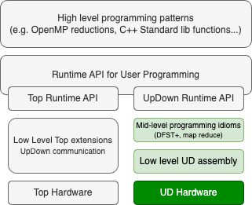
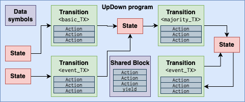
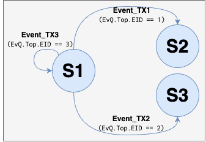
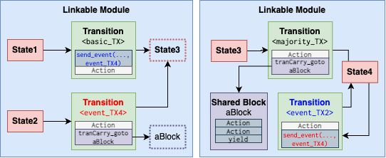

# Linker for the UpDown Architecture

This library represents all the tools needed for the UpDown architecture. 

Below is all the necessary background needed to understand UpDown linking. 

## UpDown program
An UpDown program is a piece of software that runs in the UpDown architecture. An
UpDown software is written in an UpDown ISA, and its instructions are meant to be executed
in the UpDown architecture only. This means, no reference to top instructions.

Following is a figure of the UpDown software infrastructure. The green colored part of the figure
refers to the blocks that are the target of the UpDown program.



In this document we refer to UpDown programs in low level UpDown assembly.

UpDown programs are structured using a description inspired by
Finate Automata Models. This was inherited from the [UAP (Unified Automata Processor) architecture](https://dl.acm.org/doi/10.1145/2830772.2830809)
and the [UDP (Unstructured Data Processor) architecture](https://dl.acm.org/doi/10.1145/3123939.3123983) architectures. UpDown programs contain mainly *states*, *transitions* and *actions*. In order to make it easier to develop programs, 
*shared blocks* are also supported. These are collection of *actions* that are not associated with any *transition* but can be used by different *transitions* 
through control transfer. Shared blocks are used to reduce the size of the program and allow code reuse.
In addition, *data symbols* allow for creation of memory references that are placed in the scratchpad memory upon loading of the UpDown program.



Notice that *Actions* (i.e., UpDown instructions), are associated to *transitions*. 
The dispatch of a specific transition depends on the lane's state identifier property. The process will be 
explained in more detail in the following sections.


### States
A *State* in an UpDown program represents a state in a Finite State Automatas. At any point, a lane is in a certain state. States are
not associated with instructions of the program. This is, a lane will not execute any instructions
when it is in a given state, instead, it will execute instructions when it is going through a transition from one state to the other.
States have an ID_name associated to it.

### Transitions
A *Transition* in an UpDown program is equivalent to a automata transition. Transitions have a origin state and a 
destination state. Transitions hold UpDown actions (i.e., instructions in UpDown ISA) that are executed as 
part of the transition process from one state to another state. Transitions allow for fast-update of the state-property.

At the moment of writing this document, UpDown supports 8 transition types:

* **basic_TX:** Fast symbol based transition executed in single cycle.
* **majority_TX:** Reduces the number of transitions within a single state. It corresponds to 
* **default_TX:** Reduces the number of transitions among states,
* **epsilon_TX:** targets providing NFA-like concurrent activations,
* **common_TX:** targets at providing “don’t care” transition for efficient representation of the string distance,
* **flagged_TX:** targets at enabling control-flow aware state transition,
* **refill_TX:** targets at variable-sized symbol execution,
* **event_TX:** allows for event based transitions from NULL to valid state.

Transitions have an ID_name associated to it in order to recognize different transitions in the program and allow linking.

In order to support fast transition between states, UpDown uses the [EffCLiP](https://newtraell.cs.uchicago.edu/files/tr_authentic/TR-2015-05.pdf) algorithm that combines a signature for placement flexibility with coupled-linear packing. Therefore resulting in a dense memory utilization of the states, and a simple hash function that allows transition through simple integer addition.

### Events:
Events deserve its own explanation as it is a key component of the UpDown architecture and UpDown programs. What differentiates an
event from other transitions is the origin of the symbol used to determine the event transition.
Events are a special type of transition that is associated with the Event Queue of the UpDown architecture, therefore, 
the EventID in the Event Queue Top determines what is the ID name of the next transition.

A special aspect of Event transitions, is that their name ID can be used as part of the send instruction in the UpDown ISA. This is because the event word refers to the EventID. Such message to the destination lane could result in a transition to a new state in that lane.

### Actions:
Actions are the UpDown ISA instructions that are executed as part of the transition process. Actions are sequentially executed from beginning to end. The lane will change its state after the last action is executed.

### Shared blocks
Shared blocks are a way to reduce the size of the program and allow code reuse. Shared blocks 
are a set of actions that are not associated with a single transition but are shared among 
different transitions. Shared blocks are identified by a name ID that is later on used as target
label for the `tranCarry_goto` instruction.

### Program flow in UpDown
This section presents an example of a program flow. A lane in the UpDown architecture is in a given state with certain transitions associated to it. Let's use the following figure for reference. 



Let's assume that our initial state for a lane is *S1*. There are three transitions are event_TX1 (S1->S2), event_TX2 (S1->S3), and event_TX3 (S1->S1). Upon arrival of an event into the event queue, the EventID from the event word will be check, and the corresponding transition will take place. For example, if the event ID is 2, the lane will execute event_TX2 (S1->S3). 

During execution of a transition, the lane will execute all the actions associated to that transition. For example, if the transition is event_TX2, the lane will execute the actions associated to event_TX2. In EFA python programming, the following code will result in increasing the value of register X9 by 1.

```python
    tran0 = S1.writeTransition("eventCarry", ## TX type
                                S1,          ## Origin state
                                S2,          ## Destination state
                                "event_TX2") ## Transition ID name
    tran0.writeAction(f"addi X9 X9 1")  X9 = X9 + 1 
```

At the end of the execution of the actions, the lane will change its state to the destination state S2. New transitions are evaluated based on S2 (these transitions out of S2 are not depicted in the figure).

If a shared block is encountered as part of the actions of a transition, the lane will execute the actions associated to the shared block
by changing the Program Counter to the location of the shared block. Shared blocks are a one
way indirection, thus there is no return from a shared block. As a consequence, the last action of a shared block should be a yield instruction.

## Linkable module
A Linkable module is an object that represents a partial or complete UpDown program. In this context *partial program* means that the module contains external symbols that have not been resolved yet. For example, a transition may be referenced in a send event instruction, but the transition is not defined within the same module.

External symbols are symbols that are not defined within the module. External symbols are resolved by the linker. The possible external symbols supported by the linkable module are:

* **Transition:** Transition ID name.
* **State:** State ID name.
* **Shared block:** Shared block ID name.

The following depicts 2 linkable modules that will be connected during the linking process.



Boxes with dotted lines represent example of external state and shared block symbols. `send_event` Actions in red and blue represent the send event instructions using an EventID that will be resolved during the linking process.

In the future, support for other symbols may be added.


